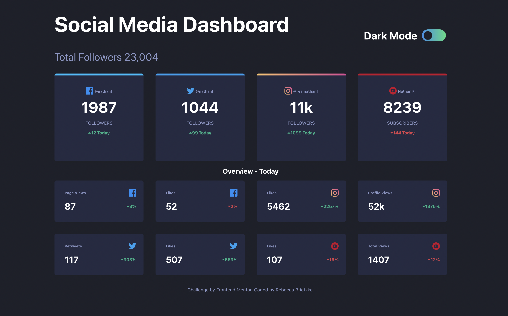

# Frontend Mentor - Social media dashboard with theme switcher solution

This is a solution to the [Social media dashboard with theme switcher challenge on Frontend Mentor](https://www.frontendmentor.io/challenges/social-media-dashboard-with-theme-switcher-6oY8ozp_H). Frontend Mentor challenges help you improve your coding skills by building realistic projects.

## Table of contents

- [Frontend Mentor - Social media dashboard with theme switcher solution](#frontend-mentor---social-media-dashboard-with-theme-switcher-solution)
  - [Table of contents](#table-of-contents)
    - [The challenge](#the-challenge)
    - [Screenshot](#screenshot)
    - [Links](#links)
  - [My process](#my-process)
    - [Built with](#built-with)
    - [What I learned](#what-i-learned)

### The challenge

Users should be able to:

- View the optimal layout for the site depending on their device's screen size
- Toggle color theme to their preference

### Screenshot

### Links

- Live Site URL: [Social Media Dashboard with Theme Switcher](https://social-media-dashboard-femc.netlify.app/)

## My process

### Built with

- React
- Typescript
- Styled Componentes
- Vite

### What I learned

This challenge helped me learn about typescript. I also got the chance to practice using styled components.
